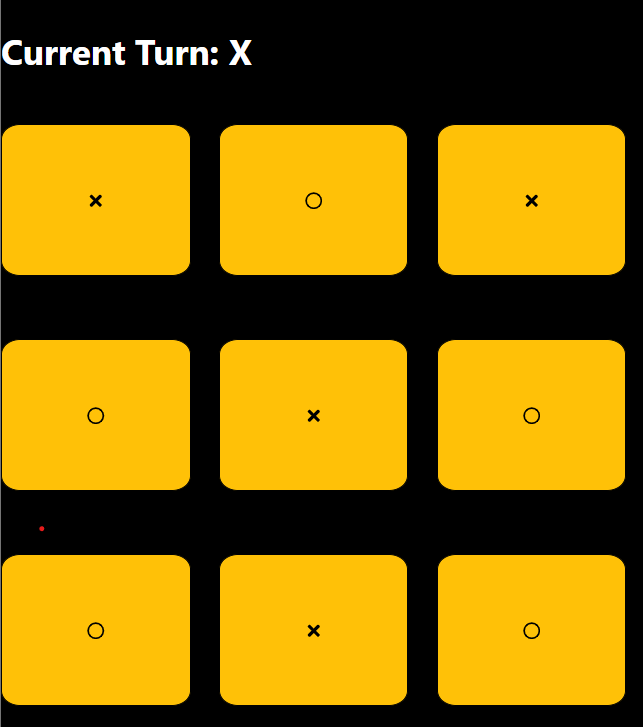

# Tic-Tac-Toe v2 🎮

A simple, interactive Tic-Tac-Toe game built with React! This project demonstrates the use of React components, state management, and event handling. The game allows two players to take turns, displays the current turn, and identifies the winner or a tie situation with a notification.



## Features 🌟

- **Two-player functionality**: Switches between "X" and "O" on each turn.
- **Winner Notification**: Highlights the winner at the end of the game.
- **Restart Game**: A button to restart the game after it finishes.
- **React Toast Notifications**: Provides winning alerts for a fun user experience.

## Project Structure 📂

This project is organized into components for modular and reusable code:

- **App.jsx**: The main application file.
- **Grid**: The Tic-Tac-Toe board component that contains logic to handle turns and winning conditions.
- **Card**: Represents each cell in the Tic-Tac-Toe grid.
- **Icon**: Displays the appropriate icon for "X" or "O" using `react-icons`.
- **IsWinner**: A utility function to check for winning conditions on the grid.

## Code Snippets 🧩

Here are some key parts of the code:

### Grid Component

```jsx
function Grid({ noOfCards }) {
  const [turn, setTurn] = useState(true);
  const [board, setBoard] = useState(Array(noOfCards).fill(""));
  const [winner, setWinner] = useState("");

  function play(index) {
    board[index] = turn ? "0" : "X";
    const winner = IsWinner(board, turn ? "0" : "X");
    if (winner) {
      setWinner(winner);
      toast(`Congratulations. ${winner} won the game.`);
    }
    setBoard([...board]);
    setTurn(!turn);
  }

  return (
    <div className="grid">
      {board.map((val, idx) => (
        <Card
          key={idx}
          player={val}
          index={idx}
          gameEnd={winner}
          onPlay={play}
        />
      ))}
    </div>
  );
}
```

### IsWinner Utility

```jsx
function IsWinner(board, symbol) {
  return (
    (board[0] === symbol && board[1] === symbol && board[2] === symbol) ||
    // More winning conditions...
    (board[2] === symbol && board[4] === symbol && board[6] === symbol)
  );
}

export default IsWinner;
```

## Installation ⚙️

1. **Clone the repository**:
   ```bash
   git clone https://github.com/iamrajanjharj/tictactoe_v2.git
   ```
2. **Navigate to the project directory**:
   ```bash
   cd tictactoe_v2
   ```
3. **Install dependencies**:
   ```bash
   npm install
   ```
4. **Run the app**:
   ```bash
   npm start
   ```

## Technologies Used 🛠️

- **React**: Core UI library.
- **React Icons**: For displaying player symbols.
- **React Toastify**: For in-game notifications.
- **CSS**: Custom styling for a polished look.

---

Enjoy the game! Feel free to contribute or open issues for feedback and improvements. 😊
